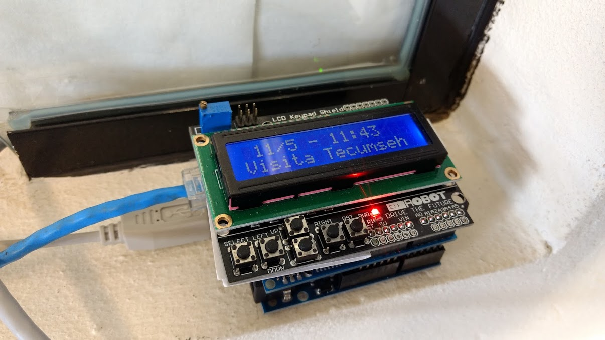

# GoogleCalendarArduinoDisplay

This set of files allows an Arduino to show in a LCD display, current events of a certain Google Agenda. I made this about one year ago (!), and this is installed on my door since then. As I have been traveling a lot and being busy outside my office frequently, I considered it would by fair to let people see in the display where I am and what I am doing. 

I simply insert or update events in my Google Calendar, and the display on the door is then automatically updated! We also mbuilt a second box for a laboratory, to show the laboratory usage agenda/calendar/reservations.

Linux crontab calls a script that downloads Google Calendar events from Google periodically and stores on a Linux Server filesystem. 

One (or more) Arduino(s) connected to the local network accesses index.php, which returns the current event of the selected calendar. 

Arduino sketch (.ino file) queries the index.php file over the network each minute, and updates the LCD display. 

Google Calendar must be configured to export a public URL of the desired Calendar.

Image shows the device working. USB Cable is just for power - the system is connected to the Ethernet network, but not a PC using USB

